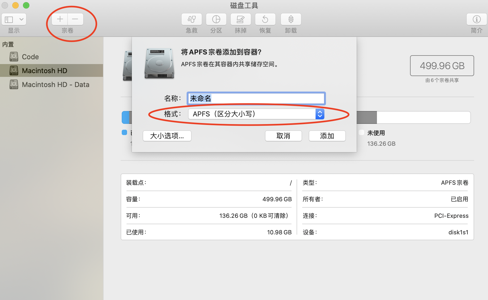
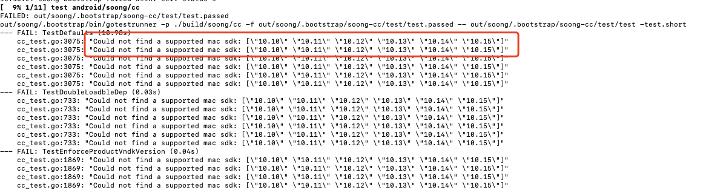
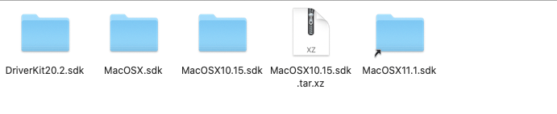
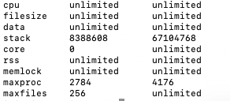

<h1>
  <center>Mac编译查看Android 源码记录</center>
</h1>
## 一、环境准备

最常见的坑就是Mac系统大小写不敏感。打开Mac磁盘工具，添加一个卷宗，格式选择区分大小写，大小选项可以不同填



## 二、获取Android源代码

鉴于国内都被墙的情况下，没法直接从google官方获取，通常都会走国内的几大开源镜像站。

我就是从清华的镜像站获取的，具体步骤我就不重复写了，请参考[清华大学开源软件镜像站](https://mirrors.tuna.tsinghua.edu.cn/)

镜像站上的源代码细分没有到最新，对于最新的源代码的分支细分，请参考[Android源代码细分版本](https://source.android.com/setup/start/build-numbers#source-code-tags-and-builds)

## 三、编译idegen

**使用命令：**

```consle
source build/envsetup.sh
make idegen
```

然后会出现如下错误：



原因是当前下载的Xcode版本所支持的Mac SDK，不在源码要求的范围内。

参考这个:[https://stackoverflow.com/questions/50760701/could-not-find-a-supported-mac-sdk-10-10-10-11-10-12-10-13](https://stackoverflow.com/questions/50760701/could-not-find-a-supported-mac-sdk-10-10-10-11-10-12-10-13)

可以从 https://github.com/phracker/MacOSX-SDKs 这个网址上下载报错提示所需的SDK

然后把下载的SDK解压到[/Applications/Xcode.app/Contents/Developer/Platforms/MacOSX.platform/Developer/SDKs]()这个目录下。

如下所示



解决上述错误后，又出现如下错误：

```console
============================================
[100% 11/11] out/soong/.bootstrap/bin/soong_build out/soong/build.ninja
FAILED: out/soong/build.ninja
out/soong/.bootstrap/bin/soong_build -t -l out/.module_paths/Android.bp.list -b out/soong -n out -d out/soong/build.ninja.d -globFile out/soong/.bootstrap/build-globs.ninja -o out/soong/build.ninja Android.bp
error: external/v8/Android.bp:181:16: module "v8_bytecode_builtins_list_generator" variant "darwin_x86_64": host_ldlibs: Host library `-lrt` not available
error: external/v8/Android.bp:209:16: module "v8_torque" variant "darwin_x86_64": host_ldlibs: Host library `-lrt` not available
10:48:14 soong bootstrap failed with: exit status 1

#### failed to build some targets (01:18 (mm:ss)) ####
```

问题原因：

https://stackoverflow.com/questions/47703239/ld-library-not-found-for-lrt

这是因为在新的glibc中用不到-lrt，所以把对应报错的Android.bp中-lrt移除掉就可以了。

然后出现 **too many open files**的错误

``` console
FAILED: out/soong/build.ninja
out/soong/.bootstrap/bin/soong_build -t -l out/.module_paths/Android.bp.list -b out/soong -n out -d out/soong/build.ninja.d -globFile out/soong/.bootstrap/build-globs.ninja -o out/soong/build.ninja Android.bp
error: external/avb/Android.bp:100:1: module "aftl_proto" variant "darwin_x86_64_PY2": glob: open /Volumes/Code/aosp/external/avb/proto: too many open files
error: external/avb/Android.bp:100:1: module "aftl_proto" variant "darwin_x86_64_PY2": doesn't have any source files!
error: external/python/uritemplates/uritemplate/Android.bp:14:1: module "py-uritemplate" variant "darwin_x86_64_PY2": doesn't have any source files!
error: cts/tests/framework/base/windowmanager/translucentapp/Android.bp:15:1: module "cts-wm-translucent-app": glob: open /Volumes/Code/aosp/cts/tests/framework/base/windowmanager/translucentapp/src: too many open files
error: cts/tests/framework/base/windowmanager/Android.bp:15:1: module "cts-wm-components": glob: open /Volumes/Code/aosp/cts/tests/framework/base/windowmanager: too many open files
error: cts/tests/framework/base/windowmanager/app_base/Android.bp:15:1: module "cts-wm-components-base": glob: open /Volumes/Code/aosp/cts/tests/framework/base/windowmanager/app_base: too many open files
error: external/python/funcsigs/funcsigs/Android.bp:15:1: module "py-funcsigs" variant "darwin_x86_64_PY2": doesn't have any source files!
error: frameworks/base/services/wifi/Android.bp:1:1: module "services.wifi-sources": glob: fcntl: too many open files
error: external/hamcrest/hamcrest-core/Android.bp:17:1: module "hamcrest" variant "darwin_common": glob: fcntl: too many open files
error: cts/libs/testserver/Android.bp:15:1: module "ctstestserver" variant "android_common": glob: fcntl: too many open files
error: frameworks/base/services/voiceinteraction/Android.bp:1:1: module "services.voiceinteraction-sources": glob: fcntl: too many open files
error: cts/tests/signature/lib/common/Android.bp:15:1: module "signature-common-javalib" variant "darwin_common": glob: fcntl: too many open files
error: external/jcommander/Android.bp:21:1: module "jcommander" variant "darwin_common": glob: fcntl: too many open files
error: external/python/asn1crypto/asn1crypto/Android.bp:14:1: module "py-asn1crypto" variant "darwin_x86_64_PY2": doesn't have any source files!
error: platform_testing/libraries/annotations/Android.bp:17:1: module "platform-test-annotations" variant "darwin_common": glob: fcntl: too many open files
error: external/snakeyaml/Android.bp:46:1: module "snakeyaml" variant "darwin_common": glob: fcntl: too many open files
error: frameworks/base/core/res/Android.bp:57:1: module "robolectric_framework_raw_res_files": glob: fcntl: too many open files
11:35:40 soong bootstrap failed with: exit status 1
ninja: build stopped: subcommand failed.

#### failed to build some targets (22 seconds) ####
```

这是因为打开了太多文件，主要是和系统配置有关。

可以使用如下命令查看

```console
launchctl limit
```

结果如下显示，其中maxfiles就是最大打开文件数限制




临时修改大小限制：

```console
ulimit -S -n 1024
```

这样之后，编译idegen总算成功了。

## 四、导入Android Studio查看

**首先生成AndroidStudio所需要的android.ipr和android.iml**

使用上面idegen编译好的文件，使用如下命令，就可以生成所需的配置文件

```console
./development/tools/idegen/idegen.sh
```

因为我们仅仅需要看framework相关源码。所以一些不必要的文件都排除掉，减少androidstuido 导入时长。需要在android.iml文件中加入如下一些代码

```console
<excludeFolder url="file://$MODULE_DIR$/art" />
<excludeFolder url="file://$MODULE_DIR$/bionic" />
<excludeFolder url="file://$MODULE_DIR$/bootable" />
<excludeFolder url="file://$MODULE_DIR$/build" />
<excludeFolder url="file://$MODULE_DIR$/cts" />
<excludeFolder url="file://$MODULE_DIR$/dalvik" />
<excludeFolder url="file://$MODULE_DIR$/developers" />
<excludeFolder url="file://$MODULE_DIR$/development" />
<excludeFolder url="file://$MODULE_DIR$/device" />
<excludeFolder url="file://$MODULE_DIR$/docs" />
<excludeFolder url="file://$MODULE_DIR$/external" />
<excludeFolder url="file://$MODULE_DIR$/hardware" />
<excludeFolder url="file://$MODULE_DIR$/kernel" />
<excludeFolder url="file://$MODULE_DIR$/libcore" />
<excludeFolder url="file://$MODULE_DIR$/libnativehelper" />
<excludeFolder url="file://$MODULE_DIR$/out" />
<excludeFolder url="file://$MODULE_DIR$/pdk" />
<excludeFolder url="file://$MODULE_DIR$/platform_testing" />
<excludeFolder url="file://$MODULE_DIR$/prebuilts" />
<excludeFolder url="file://$MODULE_DIR$/sdk" />
<excludeFolder url="file://$MODULE_DIR$/system" />
<excludeFolder url="file://$MODULE_DIR$/test" />
<excludeFolder url="file://$MODULE_DIR$/toolchain" />
<excludeFolder url="file://$MODULE_DIR$/tools" />
<excludeFolder url="file://$MODULE_DIR$/.repo" />
```

然后open an exist project 打开android.ipr。

